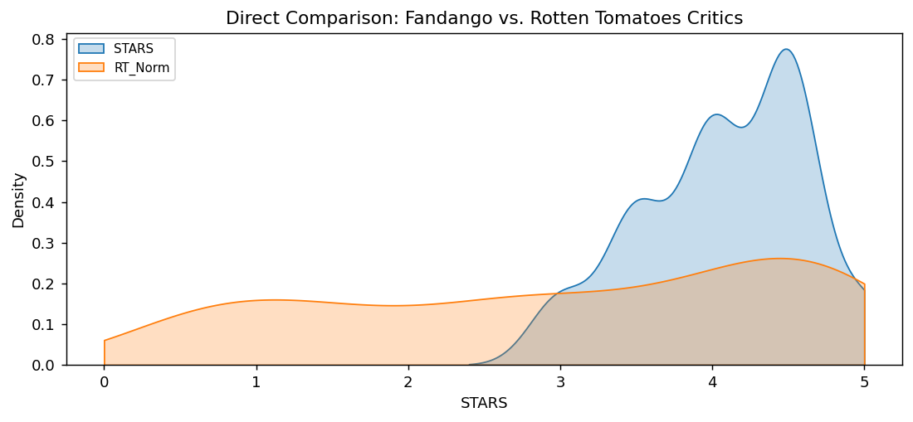

# Fandango Movie Rating Bias Analysis

## 📌 Project Overview
**Goal:** This project investigates whether Fandango artificially inflated movie ratings in 2015 to increase ticket sales.
**Context:** Based on the analysis by FiveThirtyEight, we compare Fandango's rating distributions against other major review aggregators (Rotten Tomatoes, Metacritic, and IMDb).

## 📊 Key Findings
1.  **Inflation:** Fandango's ratings are heavily skewed. Almost no movies are rated below 3 stars, whereas other sites show a normal distribution of good and bad movies.
2.  **The "Rounding" Bias:** Fandango rounds ratings up to the nearest half-star (e.g., a 4.1 becomes a 4.5), significantly boosting scores.
3.  **Discrepancy on "Bad" Movies:** The bias is most extreme for movies that critics hate. For example, *Taken 3* received a **4.5 star** rating on Fandango despite a **<10%** approval rating on Rotten Tomatoes.

## 🛠️ Tools Used
* **Python:** Data Cleaning & Analysis
* **Pandas:** Merging datasets and normalizing scores (0-5 scale).
* **Seaborn/Matplotlib:** Visualizing distributions (KDE plots) and correlations (Heatmaps).

## 📂 File Structure
* `Fandango_Analysis.ipynb`: The main Jupyter Notebook containing the code and visualizations.
* `data/`: Contains the raw datasets (`fandango_scrape.csv` and `all_sites_scores.csv`).

## 📈 Visualizations

### 1. Evidence of Rating Inflation

*Fandango's ratings (Orange) are skewed heavily positive compared to Rotten Tomatoes (Blue).*

### 2. Distribution Of Ratings Across All Sites

*Comparison of all the ratings from all the sites to provide an overview.*

### 3. The Rounding Mechanism

*Fandango systematically rounds "Actual Ratings" (Red) up to the nearest half-star (Blue).*

